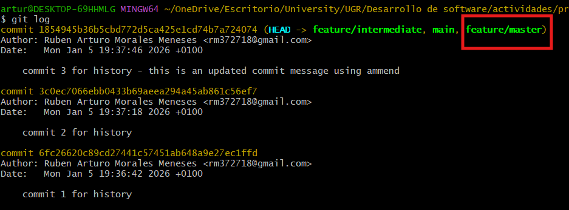
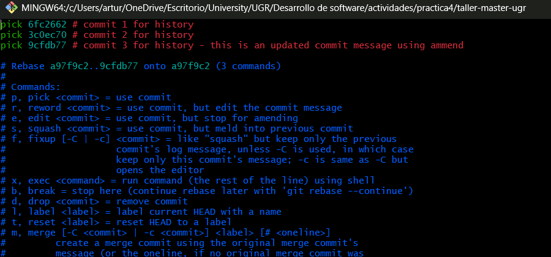

# Exercise Outcomes Submission Template

**Student/Group Name**: [Ruben Arturo Morales Meneses]  
**Level Completed**: [master / master-of-the-universe]  
**Date**: [05/01/2026]

---

## 📋 Exercise Summary

### Exercise: [Exercise Title]
**Status**: ✅ Completed

**What I did**:
I apply the ammend and rebase concepts in my the Git project, git rebase to apply commits into the main branch

**Commands Used**:
```bash
git commit --amend
git commit --amend --no-edit

git rebase main

git rebase -i
git rebase --continue

```

**Results/Output**:
```
$ git log
commit 1854945b36b5cbd772d5ca425e1cd74b7a724074 (HEAD -> feature/intermediate, main, feature/master)
Author: Ruben Arturo Morales Meneses <rm372718@gmail.com>
Date:   Mon Jan 5 19:37:46 2026 +0100

    commit 3 for history - this is an updated commit message using ammend

commit 3c0ec7066ebb0433b69aeea294a45ab861c56ef7
Author: Ruben Arturo Morales Meneses <rm372718@gmail.com>
Date:   Mon Jan 5 19:37:18 2026 +0100

    commit 2 for history

commit 6fc26620c89cd27441c57451ab648a9e27ec1ffd
Author: Ruben Arturo Morales Meneses <rm372718@gmail.com>
Date:   Mon Jan 5 19:36:42 2026 +0100

    commit 1 for history


  
Successfully rebased and updated refs/heads/feature/intermediate.

artur@DESKTOP-69HHMLG MINGW64 ~/OneDrive/Escritorio/University/UGR/Desarrollo de software/actividades/practica4/taller-master-ugr (feature/intermediate)
$ git log
commit 9cfdb771bcf707f1bd7357a8d3fcb3dc9cdf2d26 (HEAD -> feature/intermediate)
Author: Ruben Arturo Morales Meneses <rm372718@gmail.com>
Date:   Mon Jan 5 19:37:46 2026 +0100

    commit 3 for history - this is an updated commit message using ammend


```

**Screenshots** :




## 🎯 Key Learnings

**Main concepts I learned**:
1. git ammend to make chances to the same commits
2. rebase for merging branches

**Skills I improved**:
- git rebase and solving merge problem with that command

---

## 🚧 Challenges Faced

### Challenge 1: [Git rebase conclict]
**Problem**: how to restore a git command, I accidentally executed a git rebase and I neede to undo that action, reflog shows the commands executed and allows you to restore to an specific HEAD.

**Solution**: I executed reflog, then I selected the HEAD 7 with git reset.

**Commands/Approach**:
```bash
$ git reflog
1854945 (HEAD -> feature/intermediate, main, feature/master) HEAD@{0}: reset: moving to HEAD@{7}
a97f9c2 (origin/feature/intermediate) HEAD@{1}: checkout: moving from main to feature/intermediate
1854945 (HEAD -> feature/intermediate, main, feature/master) HEAD@{2}: reset: moving to HEAD@{5}
1854945 (HEAD -> feature/intermediate, main, feature/master) HEAD@{3}: reset: moving to HEAD@{2}
9602351 (origin/main, origin/HEAD) HEAD@{4}: checkout: moving from feature/intermediate to main
a97f9c2 (origin/feature/intermediate) HEAD@{5}: checkout: moving from feature/master to feature/intermediate
1854945 (HEAD -> feature/intermediate, main, feature/master) HEAD@{6}: rebase (abort): returning to refs/heads/feature/master
9effaa8 HEAD@{7}: rebase (start): checkout main


 git reset --hard HEAD@{6}

```


## 💭 Personal Reflection

**What surprised me**:
I liked how ammend worked, but rebase not too much.

**What I found most difficult**:
Solving git rebase conflict

**What I found most useful**:
Git ammend is useful if you want to incluse changes to a existing commit

**How I would apply this in real projects**:
Ammend if I want to add new changes.

---

## 📊 Self-Assessment

Rate your confidence level for each topic (1-5, where 5 is very confident):

| Topic | Confidence (1-5) | Notes |
|-------|------------------|-------|
| Basic Git commands | [5] | |
| Branching & merging | [5] | |
| Remote operations | [5] | |
| Conflict resolution | [5] | |
| History rewriting | [3] | |
| Git hooks | [1] | |
| Security practices | [1] | |

---

## 🔗 Evidence/Artifacts

**Links to branches/commits**:
- Link to your outcome branch: `https://github.com/Ruben6543/taller-master-ugr/commits/feature/intermediate/`
- Key commits demonstrating your work:
  - Commit hash: [1854945b36]


---

## ✅ Completion Checklist

Before submitting, ensure you have:
- [] Completed the exercise for your chosen level (including all parts)
- [x] Documented all commands used with their outputs
- [X] Described challenges and how you resolved them
- [X] Provided a thoughtful reflection on your learning
- [X] Self-assessed your confidence in each topic
- [X] Pushed your outcome branch to the remote repository
- [ ] Created a Pull Request (if required by your instructor)


**Submission Date**: [05/01/2026]  
**Ready for Review**: ✅ Yes
