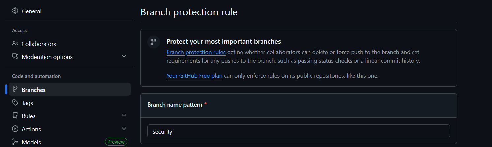

# MASTER OF THE UNIVERSE

**Student/Group Name**: [Ruben Arturo Morales Meneses]  
**Level Completed**: [master / master-of-the-universe]  
**Date**: [06/01/2025]

---

## 📋 Exercise Summary

### Exercise: [Security]
**Status**: ✅ Completed

**What I did**:
[Brief description of what you accomplished in this exercise. Since each level has one comprehensive exercise with multiple parts, describe your overall achievement and the key parts you completed.]

**Commands Used**:
```bash
# List the key Git commands you used across all parts of the exercise
git command1
git command2
# etc.
```

**Results/Output**:
```
$ git push -f origin feature/master-of-the-universe
Enumerating objects: 7, done.
Counting objects: 100% (7/7), done.
Delta compression using up to 12 threads
Compressing objects: 100% (5/5), done.
Writing objects: 100% (5/5), 53.28 KiB | 580.00 KiB/s, done.
Total 5 (delta 2), reused 0 (delta 0), pack-reused 0 (from 0)
remote: Resolving deltas: 100% (2/2), completed with 2 local objects.
remote: Bypassed rule violations for refs/heads/feature/master-of-the-universe:
remote:
remote: - Cannot force-push to this branch
remote:
To github.com:Ruben6543/taller-master-ugr.git
 + bbbec41...0de97f7 feature/master-of-the-universe -> feature/master-of-the-universe (forced update)

```

**Screenshots** (if applicable):


---

## 🎯 Key Learnings

**Main concepts I learned**:
1. [Concept 1, e.g., "How to create and switch between branches efficiently"]
2. [Concept 2, e.g., "The difference between merge and rebase"]
3. [Concept 3]

**Skills I improved**:
- [Skill 1, e.g., "Reading and understanding Git logs"]
- [Skill 2, e.g., "Resolving merge conflicts"]
- [Skill 3]

---

## 🚧 Challenges Faced

### Challenge 1: [Brief title]
**Problem**: [Describe the challenge you encountered]

**Solution**: [Explain how you resolved it or what you learned from it]

**Commands/Approach**:
```bash
# Commands or approach used to solve the problem
```

---

### Challenge 2: [Brief title]
**Problem**: [Describe the challenge]

**Solution**: [Your resolution]

---

## 💭 Personal Reflection

**What surprised me**:
[What unexpected things did you discover about Git?]

**What I found most difficult**:
[Which concepts or exercises were most challenging?]

**What I found most useful**:
[Which skills do you think will be most valuable in real projects?]

**How I would apply this in real projects**:
[Describe how you might use these Git skills in professional work]

---

## 📊 Self-Assessment

Rate your confidence level for each topic (1-5, where 5 is very confident):

| Topic | Confidence (1-5) | Notes |
|-------|------------------|-------|
| Basic Git commands | [ ] | |
| Branching & merging | [ ] | |
| Remote operations | [ ] | |
| Conflict resolution | [ ] | |
| History rewriting | [ ] | |
| Git hooks | [ ] | |
| Security practices | [ ] | |

---

## 🔗 Evidence/Artifacts

**Links to branches/commits**:
- Link to your outcome branch: `https://github.com/miguel-oltra/taller-master-ugr/tree/group-X-outcomes/[level]`
- Key commits demonstrating your work:
  - Commit hash: [Short description]
  - Commit hash: [Short description]

**Additional files created** (if any):
- File 1: [Description]
- File 2: [Description]

---

## ✅ Completion Checklist

Before submitting, ensure you have:
- [ ] Completed the exercise for your chosen level (including all parts)
- [ ] Documented all commands used with their outputs
- [ ] Described challenges and how you resolved them
- [ ] Provided a thoughtful reflection on your learning
- [ ] Self-assessed your confidence in each topic
- [ ] Pushed your outcome branch to the remote repository
- [ ] Created a Pull Request (if required by your instructor)

---

## 📝 Additional Comments

[Any additional thoughts, questions, or feedback about the exercises]

---

**Submission Date**: [Date]  
**Ready for Review**: ✅ Yes / ❌ No
