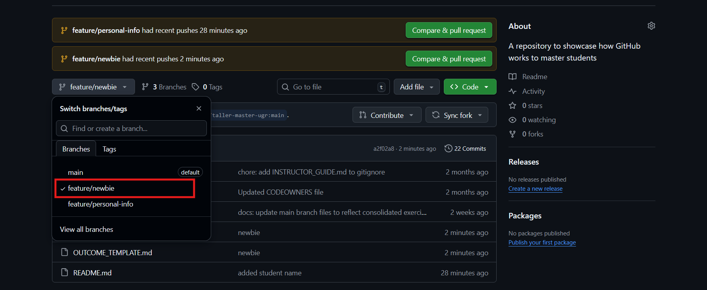

# Newbie Level

**Student/Group Name**: [Ruben Arturo Morales Meneses]  
**Level Completed**: [newbie]  
**Date**: [05/01/2026]

---

## 📋 Exercise Summary

### Exercise: Newbie
**Status**: ✅ Completed

**What I did**:
I've created a new branch including basic git commands to create and modify files.

**Commands Used**:
```bash
# List the key Git commands you used across all parts of the exercise

git clone git@github.com:Ruben6543/taller-master-ugr.git
git remote add upstream git@github.com:miguel-oltra/taller-master-ugr.git
git checkout -b feature/newbie
git add .
git commit -m "newbie"
git push origin feature/newbie

```

**Results/Output**:
```
$ git push origin feature/newbie
Enumerating objects: 6, done.
Counting objects: 100% (6/6), done.
Delta compression using up to 12 threads
Compressing objects: 100% (3/3), done.
Writing objects: 100% (4/4), 381 bytes | 381.00 KiB/s, done.
Total 4 (delta 2), reused 0 (delta 0), pack-reused 0 (from 0)
remote: Resolving deltas: 100% (2/2), completed with 2 local objects.
remote:
remote: Create a pull request for 'feature/newbie' on GitHub by visiting:
remote:      https://github.com/Ruben6543/taller-master-ugr/pull/new/feature/newbie
remote:
To github.com:Ruben6543/taller-master-ugr.git
 * [new branch]      feature/newbie -> feature/newbie

```

**Screenshots**:
- 

---

## 🎯 Key Learnings

**Main concepts I learned**:
1. How to fork a repository and clone to a local branch.
2. How to create new branches and make updates with commits.
3. How to push branches to a remote repository

**Skills I improved**:
- Forks


## 💭 Personal Reflection

**What surprised me**:
How forks work.

**What I found most difficult**:
To create a fork  in my local repository.

**What I found most useful**:
Making my own chances into my local repository

**How I would apply this in real projects**:
To try new features by my own.

---

## 📊 Self-Assessment

Rate your confidence level for each topic (1-5, where 5 is very confident):

| Topic | Confidence (1-5) | Notes |
|-------|------------------|-------|
| Basic Git commands | [5] | |
| Branching & merging | [5] | |
| Remote operations | [5] | |
| Conflict resolution | [1] | |
| History rewriting | [1] | |
| Git hooks | [1] | |
| Security practices | [1] | |

---

## 🔗 Evidence/Artifacts

**Links to branches/commits**:
- Link to your outcome branch: `https://github.com/Ruben6543/taller-master-ugr/tree/feature/newbie`
- Key commits demonstrating your work:
  - Commit hash: [a2f02a8]


**Additional files created**:
- File 1: NEWBIE_EXCERCISE.md


---

## ✅ Completion Checklist

Before submitting, ensure you have:
- [x] Completed the exercise for your chosen level (including all parts)
- [x] Documented all commands used with their outputs
- [ ] Described challenges and how you resolved them
- [x] Provided a thoughtful reflection on your learning
- [x] Self-assessed your confidence in each topic
- [x] Pushed your outcome branch to the remote repository
- [ ] Created a Pull Request (if required by your instructor)


**Submission Date**: [05/01/2026]  
**Ready for Review**: ✅ Yes 
